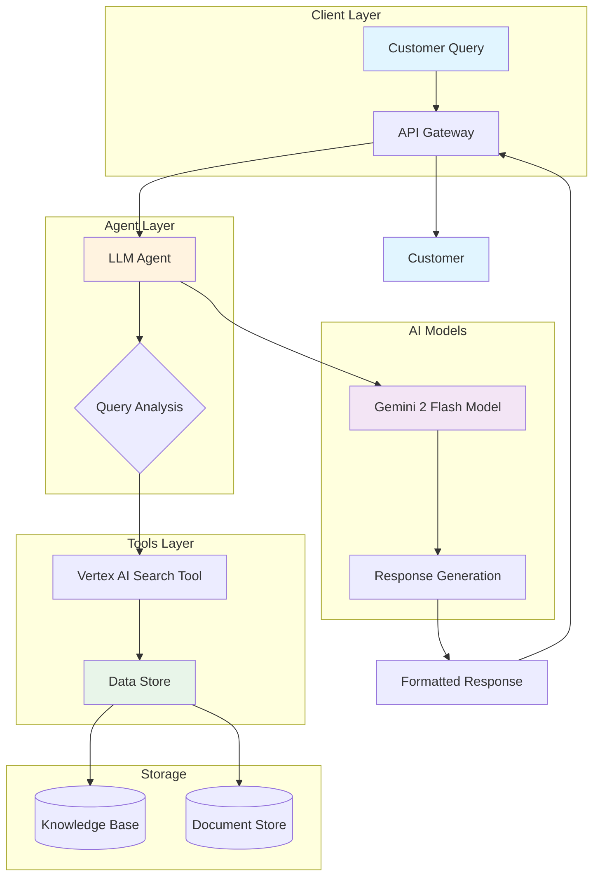
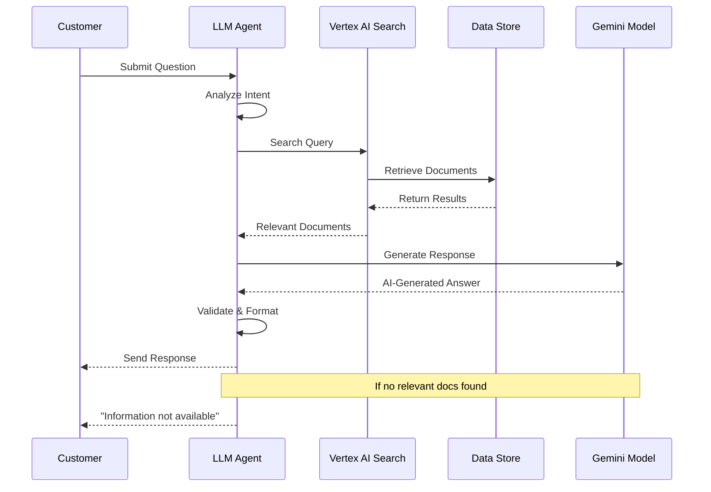
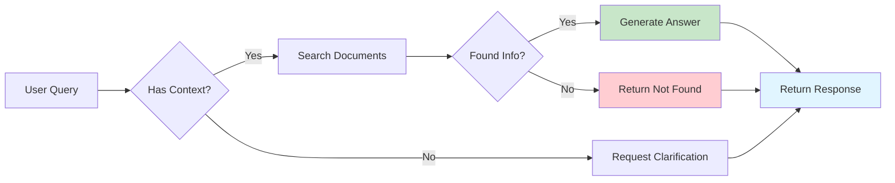
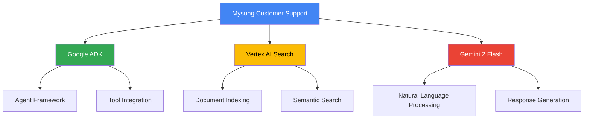

# 🎯 Mysung Customer Support System

[](https://www.python.org/)
[](https://cloud.google.com/agent-development-kit)
[](https://cloud.google.com/vertex-ai)

A sophisticated AI-powered customer support system built with Google Agent Development Kit (ADK) and Vertex AI Search, providing intelligent document-based question answering for customer inquiries.

## 📋 Table of Contents

- [Features](#features)
- [Architecture](#architecture)
- [System Workflow](#system-workflow)
- [Prerequisites](#prerequisites)
- [Installation](#installation)
- [Configuration](#configuration)
- [Usage](#usage)
- [Project Structure](#project-structure)
- [Technology Stack](#technology-stack)
- [Contributing](#contributing)
- [License](#license)

## ✨ Features

| Feature | Description | Status |
|---------|-------------|--------|
| 🤖 **AI Agent** | Intelligent customer support agent powered by Gemini 2 Flash | ✅ Active |
| 🔍 **Vertex AI Search** | Advanced document search and retrieval | ✅ Active |
| 📚 **Document QA** | Context-aware question answering from knowledge base | ✅ Active |
| 🎯 **Smart Routing** | Automatic query routing to appropriate data stores | ✅ Active |
| 🚀 **Fast Responses** | Optimized with Gemini Flash model for quick replies | ✅ Active |
| 📊 **Structured Data** | Organized information retrieval and presentation | ✅ Active |

## 🏗️ Architecture



## 🔄 System Workflow



## 🔧 Prerequisites

Before you begin, ensure you have the following installed and configured:

| Requirement | Version | Purpose |
|------------|---------|---------|
| **Python** | 3.8+ | Runtime environment |
| **Google Cloud Account** | - | Access to GCP services |
| **Vertex AI API** | Enabled | AI/ML capabilities |
| **Vertex AI Search** | Configured | Document search functionality |
| **Google ADK** | Latest | Agent development framework |

## 📦 Installation

### Step 1: Clone the Repository

```bash
git clone https://github.com/Yash-Kavaiya/mysung-customer-support.git
cd mysung-customer-support
```

### Step 2: Set Up Python Environment

```bash
# Create virtual environment
python -m venv .venv

# Activate virtual environment
# On Linux/Mac:
source .venv/bin/activate
# On Windows:
.venv\Scripts\activate
```

### Step 3: Install Dependencies

```bash
cd adk-backend
pip install -r requirements.txt
```

### Step 4: Configure Google Cloud

```bash
# Authenticate with Google Cloud
gcloud auth application-default login

# Set your project
gcloud config set project YOUR_PROJECT_ID
```

## ⚙️ Configuration

### Environment Variables

Create a `.env` file in the `adk-backend` directory:

```env
GOOGLE_CLOUD_PROJECT=your-project-id
DATASTORE_PATH=your-datastore-path
AGENT_NAME_VSEARCH=mysung-support-agent
GEMINI_2_FLASH=gemini-2.0-flash-exp
```

### Configuration Parameters

| Parameter | Type | Description | Default |
|-----------|------|-------------|---------|
| `DATASTORE_PATH` | String | Vertex AI Search datastore ID | Required |
| `AGENT_NAME_VSEARCH` | String | Name identifier for the agent | `mysung-support-agent` |
| `GEMINI_2_FLASH` | String | Gemini model version | `gemini-2.0-flash-exp` |
| `model` | String | AI model to use | Gemini 2 Flash |
| `instruction` | String | Agent system prompt | Customizable |

### Data Store Setup

1. **Create a Vertex AI Search Data Store:**
   - Go to Google Cloud Console
   - Navigate to Vertex AI Search
   - Create a new data store
   - Upload your knowledge base documents

2. **Update Configuration:**
   - Copy your data store path
   - Update `DATASTORE_PATH` in `agent.py`

## 🚀 Usage

### Starting the Agent

```python
from adk_backend.agent import root_agent

# The agent is ready to use
response = root_agent.query("How do I reset my password?")
print(response)
```

### Example Queries

```python
# Customer support query
response = root_agent.query("What are your business hours?")

# Product information
response = root_agent.query("Tell me about warranty coverage")

# Troubleshooting
response = root_agent.query("My device won't turn on")
```

### Response Flow



## 📁 Project Structure

```
mysung-customer-support/
│
├── adk-backend/              # Backend agent implementation
│   ├── __init__.py          # Package initialization
│   ├── agent.py             # Main agent configuration
│   ├── requirements.txt     # Python dependencies
│   └── .env                 # Environment variables (not in repo)
│
├── .gitignore               # Git ignore rules
└── README.md                # This file
```

### File Descriptions

| File | Purpose |
|------|---------|
| `agent.py` | Core agent logic with LLM and search tool integration |
| `requirements.txt` | Python package dependencies |
| `__init__.py` | Python package initialization |
| `.env` | Environment configuration (local only) |

## 🛠️ Technology Stack



### Core Technologies

| Technology | Version | Purpose |
|-----------|---------|---------|
| **Google ADK** | Latest | Agent development framework |
| **Vertex AI Search** | - | Enterprise search solution |
| **Gemini 2 Flash** | Latest | Large language model |
| **Python** | 3.8+ | Programming language |

## 🤝 Contributing

We welcome contributions! Please follow these steps:

1. **Fork the repository**
2. **Create a feature branch**
   ```bash
   git checkout -b feature/your-feature-name
   ```
3. **Make your changes**
4. **Commit with clear messages**
   ```bash
   git commit -m "Add: your feature description"
   ```
5. **Push to your fork**
   ```bash
   git push origin feature/your-feature-name
   ```
6. **Open a Pull Request**

### Development Workflow


## 📄 License

This project is licensed under the MIT License - see the LICENSE file for details.

## 📞 Support

For questions or issues:

- 📧 Email: support@mysung.com
- 🐛 Issues: [GitHub Issues](https://github.com/Yash-Kavaiya/mysung-customer-support/issues)
- 💬 Discussions: [GitHub Discussions](https://github.com/Yash-Kavaiya/mysung-customer-support/discussions)

## 🙏 Acknowledgments

- Google Cloud Platform for ADK and Vertex AI
- Gemini team for the powerful language model
- All contributors to this project

---

<div align="center">

**Made with ❤️ by the Mysung Team**

[⬆ Back to Top](#-mysung-customer-support-system)

</div>