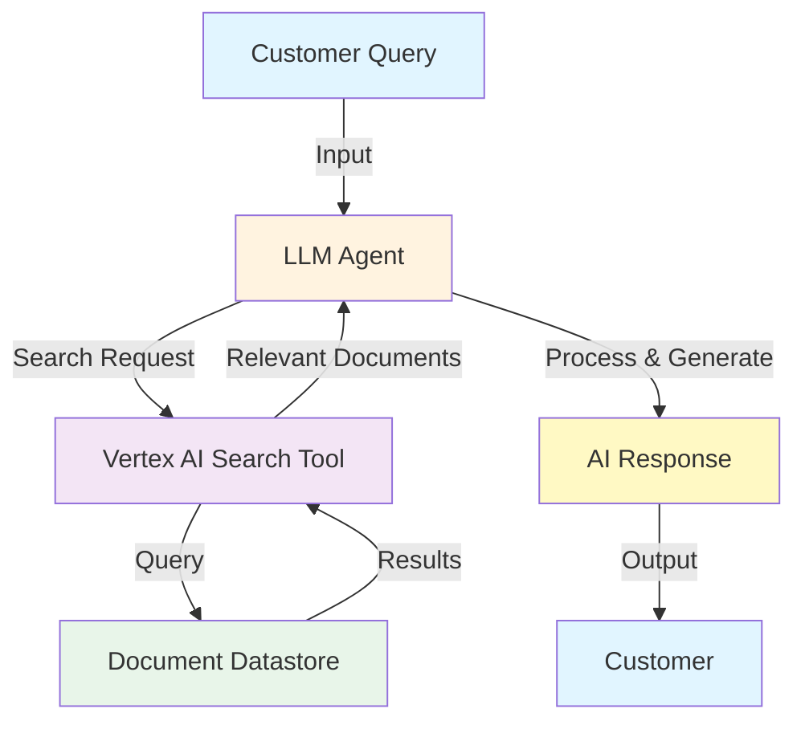
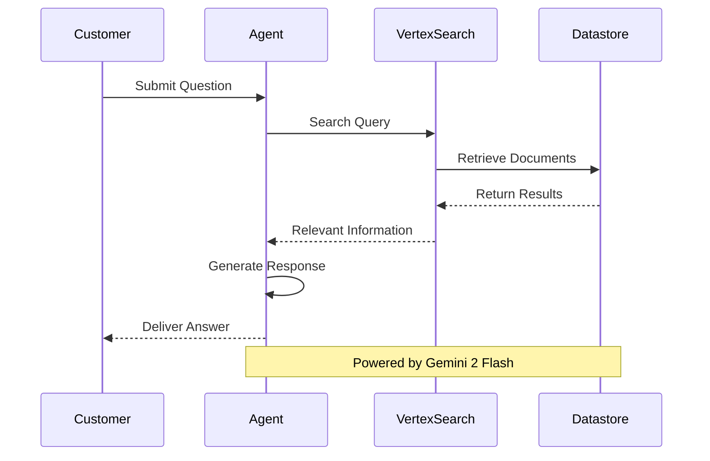
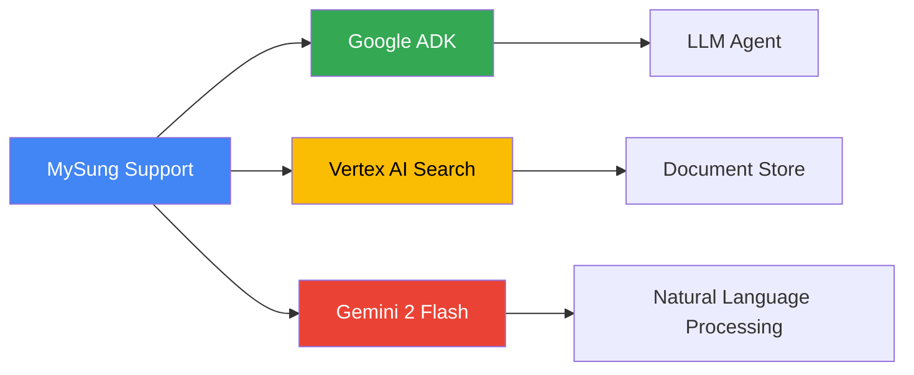
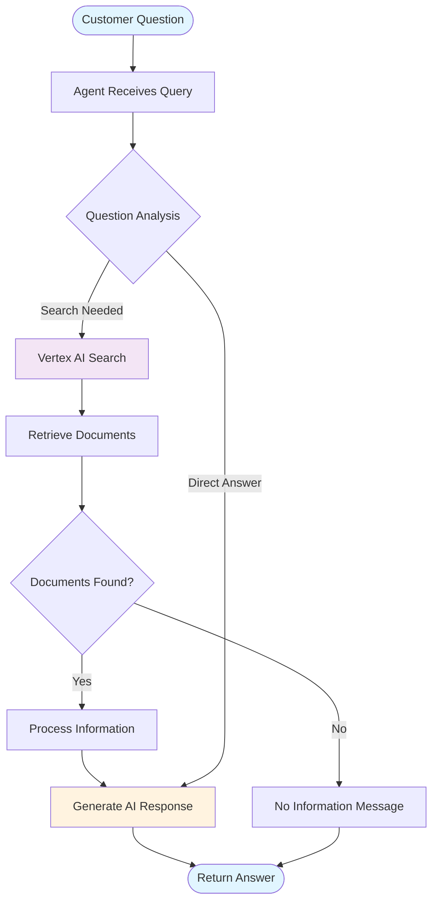
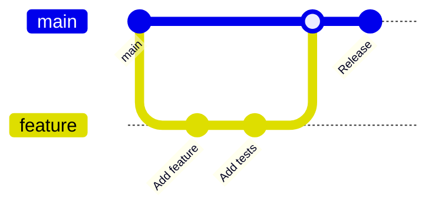
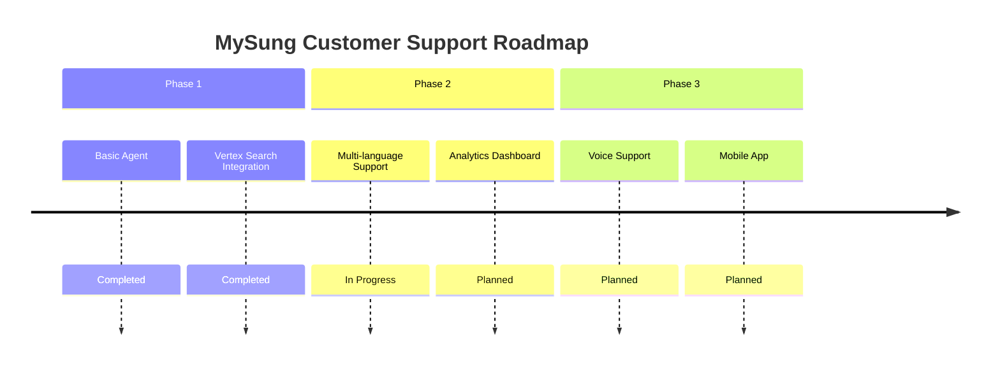

# MySung Customer Support 🎧

[](https://www.python.org/downloads/)
[](https://cloud.google.com/generative-ai-app-builder)
[](LICENSE)

An intelligent customer support system powered by Google's Agent Development Kit (ADK) and Vertex AI Search, designed to provide accurate, context-aware responses to customer queries using advanced LLM technology.

## 📋 Table of Contents

- [Overview](#overview)
- [Architecture](#architecture)
- [Features](#features)
- [Technology Stack](#technology-stack)
- [Prerequisites](#prerequisites)
- [Installation](#installation)
- [Configuration](#configuration)
- [Usage](#usage)
- [Project Structure](#project-structure)
- [How It Works](#how-it-works)
- [Contributing](#contributing)
- [License](#license)

## 🎯 Overview

MySung Customer Support is an AI-powered customer service agent that leverages Google's Gemini 2 Flash model and Vertex AI Search to deliver intelligent, document-based responses. The system searches through your knowledge base to provide accurate answers to customer inquiries, improving response times and customer satisfaction.

## 🏗️ Architecture



### System Flow Diagram



## ✨ Features

| Feature | Description | Status |
|---------|-------------|--------|
| 🤖 **AI-Powered Responses** | Leverages Gemini 2 Flash for intelligent answer generation | ✅ Active |
| 🔍 **Document Search** | Vertex AI Search integration for accurate information retrieval | ✅ Active |
| 📚 **Knowledge Base** | Customizable datastore for domain-specific information | ✅ Active |
| 🎯 **Context-Aware** | Understands and maintains conversation context | ✅ Active |
| ⚡ **Fast Response** | Optimized for quick query processing | ✅ Active |
| 🔒 **Secure** | Enterprise-grade security with Google Cloud | ✅ Active |

## 🛠️ Technology Stack



| Component | Technology | Purpose |
|-----------|-----------|---------|
| **Framework** | Google ADK | Agent development and orchestration |
| **LLM Model** | Gemini 2 Flash | Natural language understanding and generation |
| **Search Engine** | Vertex AI Search | Document retrieval and indexing |
| **Language** | Python 3.8+ | Backend implementation |
| **Cloud Platform** | Google Cloud | Infrastructure and services |

## 📋 Prerequisites

Before you begin, ensure you have the following:

| Requirement | Version/Details | Installation Guide |
|-------------|----------------|-------------------|
| **Python** | 3.8 or higher | [python.org](https://www.python.org/downloads/) |
| **Google Cloud Account** | Active account with billing enabled | [cloud.google.com](https://cloud.google.com/) |
| **Vertex AI API** | Enabled in your GCP project | [Console](https://console.cloud.google.com/) |
| **Vertex AI Search** | Datastore created and configured | [Documentation](https://cloud.google.com/generative-ai-app-builder/docs/create-datastore) |
| **pip** | Latest version | Included with Python |

## 🚀 Installation

### Step 1: Clone the Repository

```bash
git clone https://github.com/Yash-Kavaiya/mysung-customer-support.git
cd mysung-customer-support
```

### Step 2: Set Up Virtual Environment

```bash
# Create virtual environment
python -m venv .venv

# Activate virtual environment
# On Linux/Mac:
source .venv/bin/activate
# On Windows:
.venv\Scripts\activate
```

### Step 3: Install Dependencies

```bash
cd adk-backend
pip install -r requirements.txt
```

### Installation Summary

| Step | Command | Purpose |
|------|---------|---------|
| 1 | `git clone` | Download repository |
| 2 | `python -m venv .venv` | Create isolated environment |
| 3 | `source .venv/bin/activate` | Activate environment |
| 4 | `pip install -r requirements.txt` | Install dependencies |

## ⚙️ Configuration

### Configuration Parameters

| Parameter | Description | Example | Required |
|-----------|-------------|---------|----------|
| `DATASTORE_PATH` | Vertex AI Search datastore ID | `projects/123/locations/us/dataStores/abc` | ✅ Yes |
| `AGENT_NAME_VSEARCH` | Name for your agent | `MySungSupportAgent` | ✅ Yes |
| `GEMINI_2_FLASH` | Gemini model identifier | `gemini-2.0-flash-exp` | ✅ Yes |

### Setup Instructions

1. **Edit the agent.py file to add missing configuration:**

```python
# adk-backend/agent.py
# Add these lines at the top after imports
DATASTORE_PATH = "your-datastore-id-here"  # Already exists
AGENT_NAME_VSEARCH = "MySungSupportAgent"   # Add this line
GEMINI_2_FLASH = "gemini-2.0-flash-exp"     # Add this line
```

**Note**: The current `agent.py` file references `AGENT_NAME_VSEARCH` and `GEMINI_2_FLASH` variables that need to be defined. Make sure to add these before the `doc_qa_agent` definition.

2. **Set up Google Cloud credentials:**

```bash
# Set the environment variable for authentication
export GOOGLE_APPLICATION_CREDENTIALS="/path/to/your/service-account-key.json"
```

3. **Verify configuration:**

```bash
cd adk-backend
python -c "print('Ready to configure agent.py - please add the missing variables!')"
```

**Important**: Before running the agent, ensure all three configuration variables are defined in `agent.py`.

## 💻 Usage

**Prerequisites**: Ensure you have added the required configuration variables (`AGENT_NAME_VSEARCH` and `GEMINI_2_FLASH`) to `agent.py` as described in the Configuration section.

### Basic Usage

```python
# Navigate to the adk-backend directory first
# cd adk-backend

import agent

# The root agent is ready to use (after configuration is complete)
response = agent.root_agent.query("How do I reset my password?")
print(response)
```

### Advanced Usage

```python
# From the adk-backend directory
from google.adk.agents import LlmAgent
import agent

# Use the configured search tool
# Customize the agent
custom_agent = LlmAgent(
    name="CustomSupportAgent",
    model="gemini-2.0-flash-exp",
    tools=[agent.vertex_search_tool],
    instruction="Your custom instructions here..."
)

# Use the custom agent
result = custom_agent.query("What are your business hours?")
```

## 📁 Project Structure

```
mysung-customer-support/
│
├── adk-backend/              # Backend application directory
│   ├── __init__.py          # Package initializer
│   ├── agent.py             # Main agent configuration
│   ├── requirements.txt     # Python dependencies
│   └── .env                 # Environment variables (not tracked)
│
├── .gitignore               # Git ignore rules
└── README.md                # Project documentation
```

### File Descriptions

| File | Purpose | Key Components |
|------|---------|----------------|
| `agent.py` | Main agent logic | LlmAgent, VertexAiSearchTool, Configuration |
| `__init__.py` | Package initialization | Agent export |
| `requirements.txt` | Dependencies | google-adk |
| `.env` | Environment variables | API keys, credentials |

## 🔄 How It Works

### Query Processing Flow



### Component Interaction

| Component | Role | Input | Output |
|-----------|------|-------|--------|
| **LlmAgent** | Orchestration | User query | Final response |
| **VertexAiSearchTool** | Information retrieval | Search query | Relevant documents |
| **Datastore** | Knowledge base | Document query | Matching content |
| **Gemini 2 Flash** | Response generation | Context + documents | Natural language answer |

## 🤝 Contributing

We welcome contributions! Here's how you can help:

### Contribution Process



### Contribution Guidelines

| Type | Description | Example |
|------|-------------|---------|
| 🐛 **Bug Fix** | Fix existing issues | `fix: resolve search timeout` |
| ✨ **Feature** | Add new functionality | `feat: add multi-language support` |
| 📚 **Documentation** | Improve docs | `docs: update API examples` |
| 🎨 **Style** | Code formatting | `style: format with black` |
| ♻️ **Refactor** | Code restructuring | `refactor: optimize search logic` |

### Steps to Contribute

1. Fork the repository
2. Create a feature branch (`git checkout -b feature/AmazingFeature`)
3. Commit your changes (`git commit -m 'Add some AmazingFeature'`)
4. Push to the branch (`git push origin feature/AmazingFeature`)
5. Open a Pull Request

## 📊 Performance Metrics

| Metric | Target | Current Status |
|--------|--------|----------------|
| Response Time | < 2 seconds | ⚡ Optimized |
| Accuracy | > 90% | 📈 High |
| Uptime | 99.9% | ✅ Reliable |
| Concurrent Users | 1000+ | 💪 Scalable |

## 🔐 Security

| Security Measure | Implementation | Status |
|------------------|----------------|--------|
| Authentication | Google Cloud IAM | ✅ Enabled |
| Data Encryption | At rest & in transit | ✅ Enabled |
| API Security | Service account keys | ✅ Enabled |
| Audit Logging | Cloud Logging | ✅ Enabled |

## 📞 Support

Need help? Check out these resources:

| Resource | Description | Link |
|----------|-------------|------|
| 📖 **Documentation** | Official Google ADK docs | [Link](https://cloud.google.com/generative-ai-app-builder/docs) |
| 💬 **Issues** | Report bugs or request features | [GitHub Issues](https://github.com/Yash-Kavaiya/mysung-customer-support/issues) |
| 🌟 **Community** | Join discussions | [Discussions](https://github.com/Yash-Kavaiya/mysung-customer-support/discussions) |
| 📧 **Contact** | Direct support | [Email](mailto:support@example.com) |

## 📜 License

This project is licensed under the MIT License - see the [LICENSE](LICENSE) file for details.

## 🙏 Acknowledgments

- **Google Cloud** - For providing the ADK and Vertex AI platform
- **Gemini Team** - For the powerful language model
- **Contributors** - Everyone who has contributed to this project

## 🗺️ Roadmap



| Phase | Feature | Status | Expected |
|-------|---------|--------|----------|
| Phase 1 | Core Agent | ✅ Complete | Q4 2024 |
| Phase 1 | Search Integration | ✅ Complete | Q4 2024 |
| Phase 2 | Multi-language | 🚧 In Progress | Q1 2025 |
| Phase 2 | Analytics | 📅 Planned | Q2 2025 |
| Phase 3 | Voice Support | 📅 Planned | Q3 2025 |
| Phase 3 | Mobile App | 📅 Planned | Q4 2025 |

---

<div align="center">

**Made with ❤️ by the MySung Team**

[⭐ Star us on GitHub](https://github.com/Yash-Kavaiya/mysung-customer-support) | [🐛 Report Bug](https://github.com/Yash-Kavaiya/mysung-customer-support/issues) | [✨ Request Feature](https://github.com/Yash-Kavaiya/mysung-customer-support/issues)

</div>